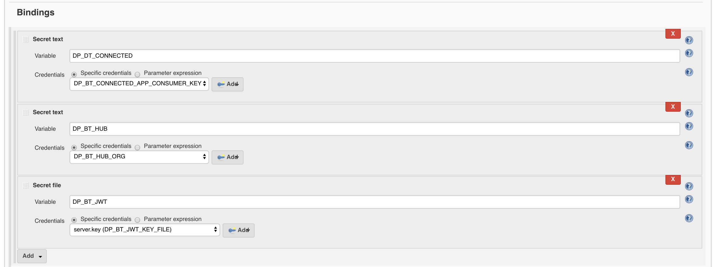
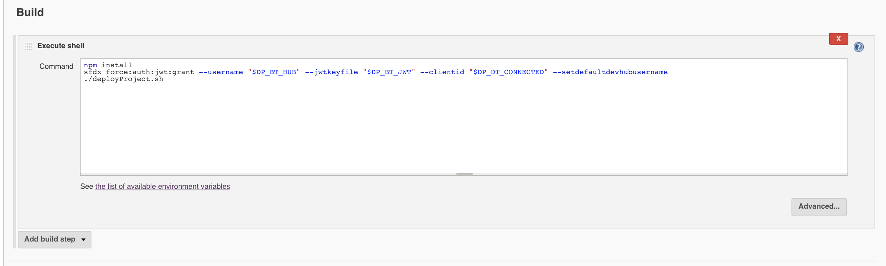

# Vlocity Build + Saleasforce DX
This project shows how Salesforce DX Scratch Orgs can be used together with the Vlocity Build Tool to create a new Org through an Automation tool like Jenkins.

The primary deployment process would be using the `deployProject.sh` script, which includes:

```bash
# Install or Update Managed Package - Will finish quickly when already correct version
sfdx force:mdapi:deploy --deploydir managed_packages/vlocity_cmt --wait -1 --targetusername $SF_USERNAME

# Push Salesforce part of Project
sfdx force:source:push --targetusername $SF_USERNAME

# Update Settings
vlocity -sfdx.username $SF_USERNAME -job VlocityBase.yaml packUpdateSettings

# Deploy vlocity_base folder
vlocity -sfdx.username $SF_USERNAME -job VlocityBase.yaml packDeploy
```

`deployProject.sh` will create a new Scratch Org unless provided with a Username as the first argument `./deployProject.sh username@test.com`.

## Vlocity Managed Package
The managed package is installed through the Metadata API with `sfdx` it is stored at the path `managed_packages/vlocity_cmt/installedPackages/vlocity_cmt.installedPackage`. The version of the package installed can be updated in this file.

```xml
<InstalledPackage xmlns="http://soap.sforce.com/2006/04/metadata">
    <versionNumber>900.171.0</versionNumber>
</InstalledPackage>
```

## Vlocity CMT Base 
The vlocity_base folder contains the DataPacks included as a result of running all the "Install BaseVlocityCards" style jobs from the Vlocity Cards UI. If you look into the repository change history you can see how different package versions changed the underlying vlocity_base objects over each release.

## Salesforce Metadata
The Salesforce Metadata is the result of installing the Vlocity Telco Unamanged Package.

# Running in Jenkins

In order to run `sfdx` in Jenkins (or any server) you must setup [JWT Authorization]. (https://developer.salesforce.com/docs/atlas.en-us.sfdx_dev.meta/sfdx_dev/sfdx_dev_auth_jwt_flow.htm) 

Salesforce additionally provides a [Trailhead for Travis CI](https://trailhead.salesforce.com/modules/sfdx_travis_ci/units/sfdx_travis_ci_connected_app)

The first step of setting up Jenkins for this project is adding the JWT Bindings:


Then adding the build step:


